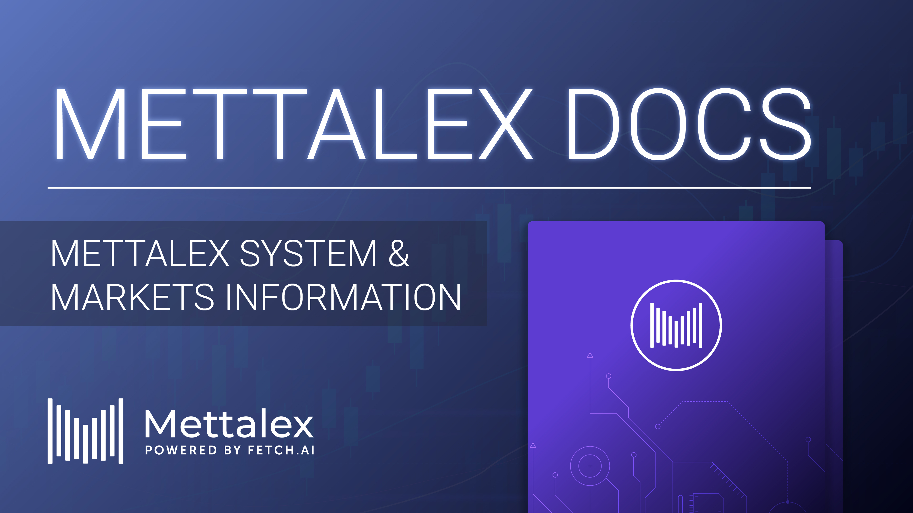

# Overview

**Mettalex** is the first decentralised derivatives exchange \(**DEX**\) powered by **Fetch.ai** technology. The main objective is to provide access to risk management tools to a large audience of physical commodity traders. Nowadays, users can access these tools via financial market intermediaries \(i.e. banks and other financial intermediaries\) who charge high spreads and have limited liquidity. Mettalex enables market participants \(e.g. crypto mining companies or steel mills\) to gain economic exposure to the spot price of commodities and other assets thus allowing them to open hedging or leveraged positions on the market.

This revolutionary network creates the base for efficient and intelligent market making decisions thanks to an **Autonomous Market Maker** \(i.e. **AMM**\). Each smart contract is associated with a pair of specially designed tokens, called **Position tokens**. The smart contract acts as a decentralised clearing house so it facilitates the matching between buyers and sellers on the market. In fact, traders can exit or open a position whenever they desire without the need to find a counterparty interested in the trade.

