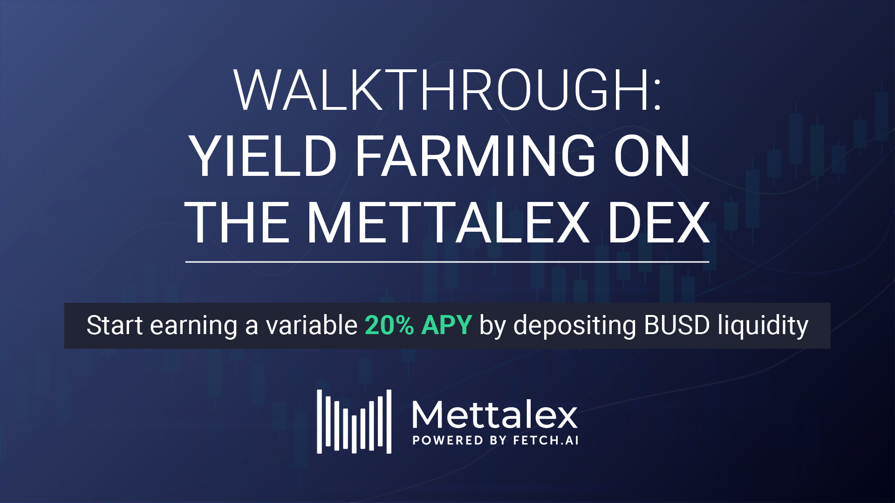

# Mettalex DEX: LP MTLX Rewards Walkthrough

Liquidity providers will soon be able to yield farm by depositing liquidity directly in the Mettalex DEX. Simply connect your Web 3 wallet (set to Binance Smart Chain), select one of the available markets on the DEX (Copper, Steel Scrap, MATIC, BNB, BTC/XAU and ETH), and deposit **BUSD** to farm rewards in MTLX at a variable 20% APY.

## DEPOSIT YOUR STABLECOIN:

1. Access the Mettalex DEX at [https://dex.mettalex.com/](https://dex.mettalex.com).
2. Connect your wallet. You can choose between Metamask or Torus.

.png>)

&#x20;3\. Select “**SUPPLY** **LIQUIDITY**”.

.png>)

4\. Select the market/pool you want to provide the liquidity to.

5\. Once selected, enter the amount of liquidity you wish to provide. You can select different amounts to be deposited (e.g. 25%, 50%, 75%, 100%). Press “**Deposit**”.

6\. Confirm the following transactions.

&#x20;

.png>)

7\. Your deposited amount is converted to mxBUSD and will be available in the “**My** **Wallet**” box. There you can see your wallet balances of BUSD, mxBUSD, BUSD available for withdrawal and MTLX tokens.

## STAKE YOUR mxBUSD AND GENERATE MTLX REWARDS

1. Once the deposit in BUSD has been made, you will be able to stake your mxBUSD to start accruing MTLX Rewards. Choose the “**MTLX** **Rewards**'' section and enter the amount you want to stake and press “**Stake**”.

.png>)

2\. Confirm the following transactions on Metamask.

3\. The amount staked will be available in the “**Balances**” box. The box also includes information regarding the amount of rewards accrued and the amount of BUSD and mxBUSD in the market/pool.

## UNSTAKE AND CLAIM REWARDS

1. On the “**Liquidity**” page, select the “**MTLX** **Rewards**” section of the market/pool where your liquidity is deposited. Enter the amount you wish to unstake and press “**Unstake**”. This will unstake your funds and the accrued MTLX rewards. If you wish to only claim your rewards without unstaking, just press “**Claim**”.

.png>)

2\. Confirm the following transaction on Metamask.

3\. Your mxBUSD and MTLX balances will be available in the “**My Wallet**” box.&#x20;

.png>)

## WITHDRAW YOUR DEPOSIT

1. Choose the “**Withdraw**” section and enter the amount you want to withdraw and press “**Withdraw**”. You can select among different amounts to be withdrawn (e.g. 25%, 50%, 75%, 100%). You can also select “**Withdraw** **All**” to withdraw your deposit and rewards accrued. _**Note**_: A fee of 1% is applied to the withdrawn amount and used for buyback of MLTX tokens.

.png>)

2\. Confirm the transaction on Metamask.

3\. The amount withdrawn will be transferred to your Web 3 wallet and the updated balance will be available in the “**My** **Wallet**” box.

.png>)

## RISKS OF PROVIDING LIQUIDITY

Mettalex is an experimental software: _**never invest more than you can afford to lose**_. &#x20;

While the protocol has been designed to minimize risk to liquidity providers there are still risks associated with using it such as:

* **Contract risk** - not all of the system components have been fully audited and the interactions between components may be outside the scope of components that have been audited separately.
* **Operational risk** - data feed outages or errors may cause contracts to settle unexpectedly.
* **Admin keys** - while full decentralization is on the Mettalex roadmap the initial implementation still relies on privileged admin access for some operations.
* **Market risk** - the fee structure, Autonomous Market Maker design, and system incentives are designed to minimize market risk for liquidity providers (see below) however they may not be eliminated entirely.&#x20;

Visit the [Risks for Traders and Liquidity Providers](overall-risks-and-benefits.md) section for further information about the risks traders and liquidity providers could face when interacting with the Mettalex AMM. When providing liquidity to Autonomous Market Makers, liquidity providers have to face the risk of **impermanent loss** and **slippage**. Fortunately, _**in Mettalex thanks to the lower volatility of the underlying assets and provision of liquidity in stablecoins, the risks of impermanent loss and slippage are controlled efficiently and are very low.**_ However, the risk is not non-existent and should be taken into consideration.

**Impermanent loss** represents the difference between the value when you are holding tokens in an AMM (Automated Market Maker) Liquidity Pool, and holding them in your wallet (e.g. Metamask). Trading activities change the ratio of tokens in the liquidity pool, and thus affect the value of deposited liquidity . The more the difference in value, the more impermanent loss the LP suffers. However, this loss is only temporary: in fact when the price of the tokens returns to the original value (upon deposit), the loss is erased. On the other hand the loss becomes a permanent one if the user withdraws the liquidity and absorbs the losses, or if the price continues to diverge and the user loses more tokens as a result.

On Mettalex, each available commodity/asset has an associated liquidity pool which contains a mix of a stablecoin and long and short position tokens (i.e. on Mettalex, these allow for exposure to the underlying asset price movements with banded exposure). When a swap on the Mettalex DEX is performed, the weights inside the AMM pool are updated in order to determine the correct prices according to some constraints (visit [Mettalex Autonomous Market Maker Mathematics](mettalex-autonomous-market-maker-mathematics.md) for further information on this topic). Each market/pool is controlled by a separate strategy smart contract that responds to trading activity and price updates based on an oracle (i.e. price feed). The strategy uses the Mettalex vault to convert a portion of the supplied stablecoin liquidity into position token pairs. As the spot price changes, the weights applied to short and long position tokens in the pool vary. If no liquidity is either deposited or withdrawn, the price of tokens would change only through trades. Once a token is being bought by a trader, its price increases whereas the price of tokens being sold by the trader decreases. In addition, the band of reference allows users to hold these tokens as long as the spot price moves and remains inside the band.

Another risk LPs could face is **slippage**. Slippage happens when traders have to settle for a different price than what initially was requested due to a movement in price between the time the order enters the market and the execution of the trade. In the crypto space this event is frequent and quite costly due to the high levels of price volatility. In addition to volatility, low volume and low liquidity may also contribute to increased slippage, especially when a large order is executed and not enough liquidity is available in the pool. Therefore, the larger the transaction volume and the deeper the destruction of the liquidity in the reference pool, the higher the slippage. However, on Mettalex each time liquidity is added the AMM rebalances the tokens in the pool by minting or redeeming position token pairs to keep the ratio of stablecoin to paired long and short tokens at around 1:1, in order to respect the aforementioned constraints.

The LPs in Mettalex work differently to other crypto based LPs. In Mettalex DEX liquidity is provided in a single token and not as a ratio of two or more tokens (like other DEXes in the DeFi space). The fact that the liquidity is provided using only stablecoins such as USDT and BUSD reduces the risk of volatility users have to face when yield farming on the DEX. The stablecoins are used as a collateral to issue position tokens whose combined value is always equal to the collateral value. Liquidity providers always face risks of potential losses when supplying liquidity to pools, but in Mettalex thanks to the lower volatility of the underlying assets and provision of liquidity in stablecoins, the risks of impermanent loss and slippage are controlled efficiently and are very low. Users providing liquidity to the Mettalex DEX to earn MTLX rewards have to face these potential risks considering also the possibility that the value of the rewards accumulated could change due to market dynamics.
