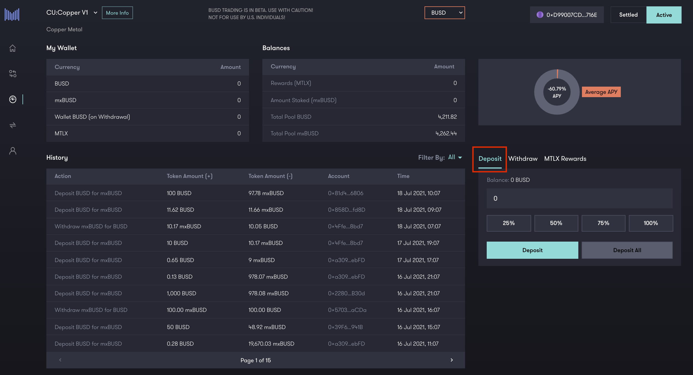
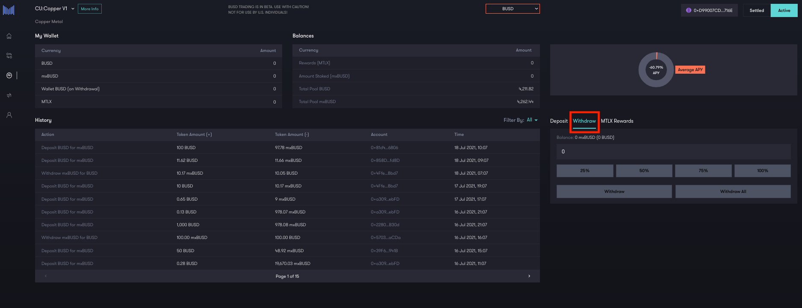
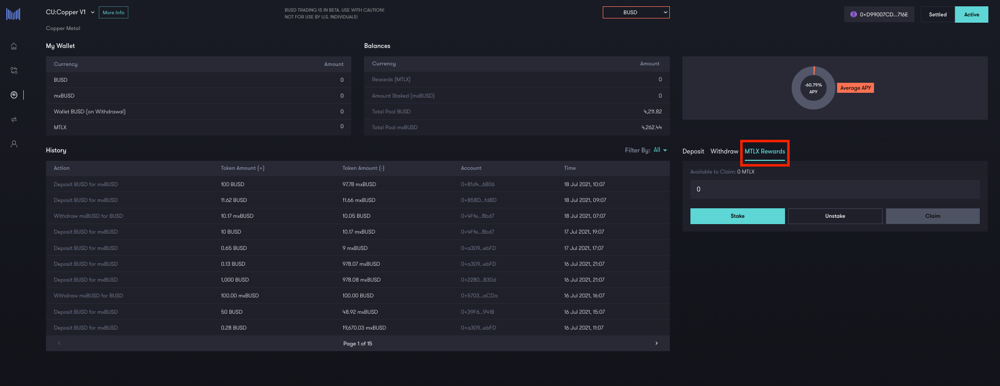

# Possible operations

In order to access the Mettalex DEX platform, visit the following link: [https://dex.mettalex.com](https://dex.mettalex.com).  Traders can access the platform using either the Ethereum Network or the Binance Smart Chain Network. You will be asked to connect your wallet by choosing one of the following wallet choices:

_**Note**_: remember that the available markets depend on the network you decide to use to interact with Mettalex DEX_** **_([markets-available-on-mettalex-dex-vega](markets-available-on-mettalex-dex-vega.md)). If you opt for the Kovan Test Network you will be able to perform operations that consider as collateral USDT whereas the Binance Smart Chain Network will allow you to execute operations considering MUSD or BUSD collateral.&#x20;

_**(BUSD TRADING IS IN BETA. USE WITH CAUTION! NOT FOR USE BY U.S. INDIVIDUALS!)**_

When entering Mettalex DEX, you can access one of the following possible sections:

****

#### **TRADE**

In this section you will be able to perform the following actions:

1. Hedge or Speculate by using the_** Swap **_functionality to buy individual Position Tokens;
2. Make Markets in position tokens on centralized exchanges by using the_** Mint **_functionality to create pairs of Long and Short position tokens from your collateral. These new tokens can then be traded elsewhere;
3. Close positions by using the_** Redeem **_functionality to burn pairs of Long and Short Position Tokens and get back the underlying collateral, or by using the Swap functionality to sell individual Position Tokens.

#### **ACCESS ACCOUNT**

You will be redirected to the** Mettalex Dashboard **. From here you can perform different actions related to their strategies and beliefs (e.g. trading or supplying liquidity). You will be able to switch among different markets.

#### SUPPLY LIQUIDITY

This section is for Liquidity Providers who wants to perform one of the following actions:

1. _**Deposit **_collateral for the Autonomous Market Maker to use to create Position Tokens for the Swap functionality.
2. _**Withdraw c**_ollateral to claim your share of the trading fees earned by the Autonomous Market Maker.
3. _**Stake**_ Liquidity Provider shares for Liquidity Mining rewards in the form of MTLX Governance tokens.

****

.png>)

## **Trading in a Market**

.png>)

It is the first category of actions that users can undertake on Mettalex DEX. Users need to visit the Mettalex Trade section in order to proceed with this action (visit the following link:[ dex.mettalex.com](http://dex.mettalex.com)). The trading section allows traders to open market positions on a wide variety of markets. It is possible to open positions considering as underlying assets either ferrous (e.g. copper, steel rebar, steel scrap, silver, gold, iron ore) or non-ferrous assets (e.g. Bitcoin or Ethereum). After choosing the market desired, the DEX will show you various information about the market itself, such as:

* Long and Short price.
* Last date on which the price was updated.
* Sentiment.
* Underlying asset graph.
* Long and Short tokens graphs.
* Floor and Cap values (i.e. Price band).
* Purchased tokens information (Symbol, purchase price, swapped price, current price, P\&L for token, total P\&L and the return).

In this section traders can convert the stable coin stored in their wallets into position tokens. This operation is called “**Swap**” and allows users to swap a certain amount of tokens in exchange for another quantity of tokens desired.

**‌**This operation happens thanks to the presence of the AMM. In fact traders do not need to interact with other participants on the market as the AMM acts as a counter party in this operation. When swapping, traders will have to pay a fee to liquidity providers in order to remunerate them for taking on timing risk from the AMM. These tokens can be used inside or outside the DEX itself. Traders can use the position token pairs either to take a position on the market or use them in operations outside it. These positions can be kept in an open status as long as the user wants to. It is in the user’s choice to decide when to close the positions on the market or not. This freedom is guaranteed by the fact that traders are allowed to close a position whenever they desire just by interacting directly with the AMM, by converting the position token pairs into stable coin** **(e.g. USDT) which will be deposited back into the user’s wallet.

## **‌Market Making**

Market Making operations are the second category of operations users can undertake on Mettalex DEX (visit the following link: [dex.mettalex.com](http://dex.mettalex.com)). As in the section before, it is possible to access these actions via the Mettalex Trade section.

Here users can not only swap their coins against the Autonomous Market Maker, but they can also mint or redeem new position tokens thanks to the dedicated windows that can be found in the same section. The market maker user interface provides additional functionality to **mint** and **redeem** Long/Short Position token pairs related to a certain underlying asset. It happens by supplying collateral to the system for token minting. Furthermore, users can supply a Long/Short Position token pair for redemption (i.e. users exchange L/S pairs against stablecoin collateral).

## Liquidity providing

Liquidity providing operations are the third category of operation users can run on Mettalex (visit the following link:[ dex.mettalex.com](http://dex.mettalex.com)). It is possible to access these actions via the Mettalex Liquidity section. Users can deposit funds represented by stablecoin collateral (i.e. USDT) and are rewarded with a further aggregated yield on the capital invested via transaction fees and trading spreads between prices, according with the amount and duration of liquidity supplied into the system. In the first page, you will have access to different information about the available markets, your wallet, the available balances of liquidity provided to each market, the average APY for the chosen market and the transaction history.

In the “**Deposit**” tab enter the amount of liquidity you want to deposit into the liquidity pool and click the “**Deposit**” button. You can deposit part of your funds thanks to the buttons shown in the deposit window (e.g. **25%**, **50%**, **75%** or **100%**). "**Deposit All**" allows the user to deposit all of his funds whereas "**Start Earning**" transfers funds from the Vault contract to the Autonomous Market Maker (AMM) contract so you can start earning trading fees.

From the home page access the “**LIQUIDITY**” page and use the drop-down menu at the top to select a commodity to withdraw liquidity from. In the liquidity provider tab, click on “**Withdraw**” and enter the amount of liquidity you want to withdraw from the liquidity pool and click the “**Withdraw**” button. You can withdraw pre-determined part of your funds (e.g. 25%, 50%, 75% or 100%). The “**Withdraw all**” button gives you the ability to withdraw all funds from the selected liquidity pool (for that specific commodity).

## Stake and Earn Rewards (MTLX)

This last set of operations are available in the "Mettalex Rewards" tab in the Mettalex Liquidity Section.&#x20;

&#x20;For further information about how to stake your liquidity, earn rewards and claim them visit the [mettalex-dex-lp-mtlx-rewards-walkthrough](mettalex-dex-lp-mtlx-rewards-walkthrough.md).
