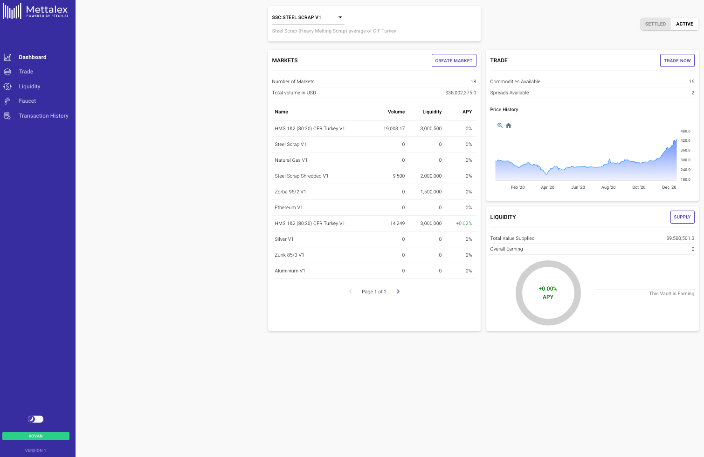
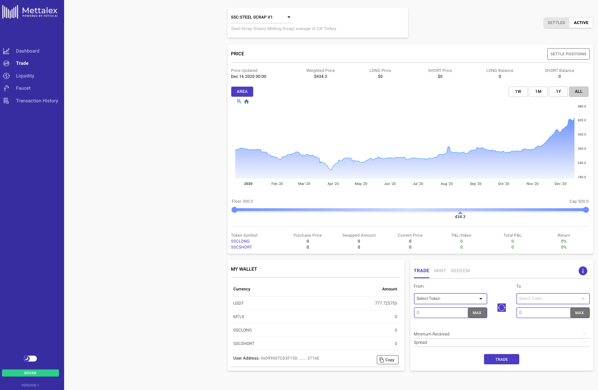
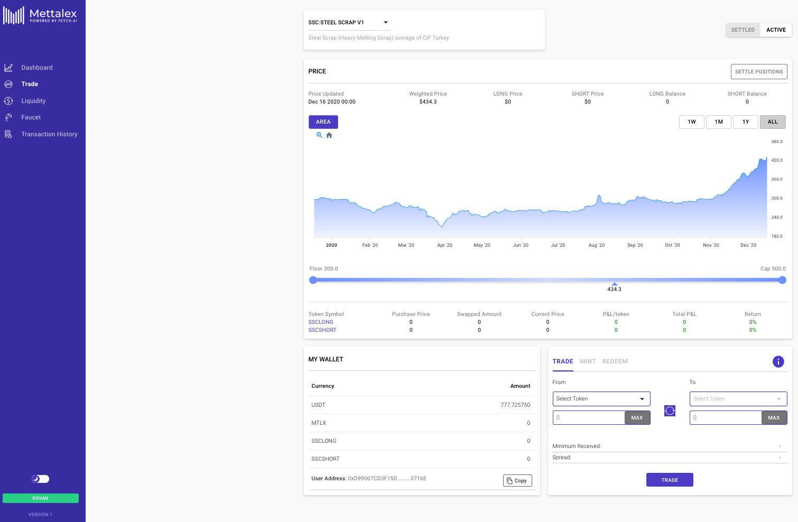
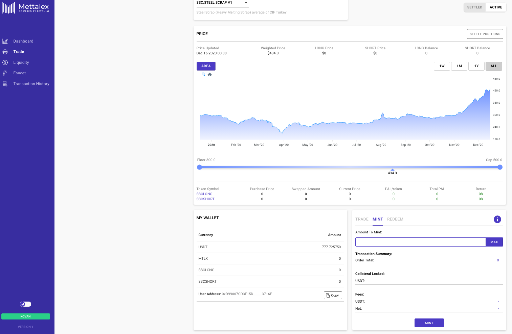
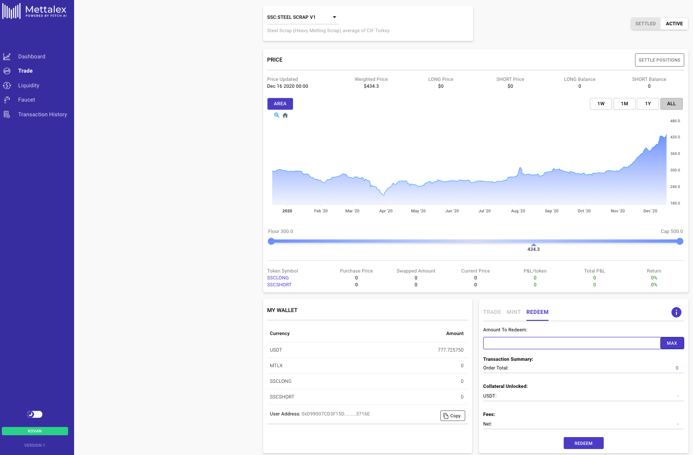

# Possible operations

When entering the Mettalex DEX platform, in the first page users will be redirected to the **Mettalex Dashboard** \(visit the following link: [https://dex.mettalex.com](https://dex.mettalex.com)\). From here users can perform different actions related to their strategies and beliefs, such as trading, supplying liquidity or creating a market.    ****

## **Trading in a Market**

It is the first category of action that users can undertake on Mettalex DEX. Users need to visit the Mettalex Trade section in order to proceed with this action \(visit the following link: [dex.mettalex.com](http://dex.mettalex.com)\). The trading section allows traders to open market positions on a wide variety of  markets. It is possible to open positions considering as underlying assets either ferrous \(e.g. copper, steel rebar, steel scrap, silver, gold iron, lithium carbonate\) or non-ferrous assets \(e.g. BitCoin or Ethereum\). From here, traders can convert the stablecoins stored in their wallets into position tokens. This operation is called “Swap” and allows users to swap a certain amount of tokens in exchange for another quantity of tokens desired**.**

This operation happens thanks to the presence of the AMM. In fact traders do not need to interact with other participants on the market as the AMM acts as a counter party in this operation. When swapping, traders will have to pay a fee to liquidity providers in order to remunerate these ones for taking on timing risk from the AMM.  These tokens can be used inside or outside the DEX itself. Traders can use the position token pairs either to take a position on the market or use them in operations outside it. These positions can be kept in an open status as long as the user wants to. It is in the user’s choice to decide when to close the positions on the market or not. This freedom is guaranteed by the fact that traders are allowed to close a position whenever they desire just by interacting directly with the AMM, by converting the position token pairs into stablecoins \(e.g. USDT\) which will be deposited back into the user’s wallet.

## **Market Making**

Market Making operations are the second category of operations users can undertake on Mettalex DEX \(visit the following link: [dex.mettalex.com](http://dex.mettalex.com)\). As in the section before, it is possible to access these actions via the Mettalex Trade section.

Here users can not only swap their coins against the Autonomous Market Maker, but they can also mint or redeem new position tokens thanks to the dedicated windows that can be found in the same section. The market maker user interface provides additional functionality to mint and ****redeem Long/Short Position token pairs related to a certain underlying asset. It happens by supplying collateral to the system for token minting. Furthermore, users can supply a Long/Short Position token pair for redemption \(i.e. users exchange L/S pairs against stablecoin collateral\).

## Liquidity providing

Liquidity providing operation represent the third category of operation users can run on Mettalex. It is possible to access these actions via the Mettalex Liquidity section.

