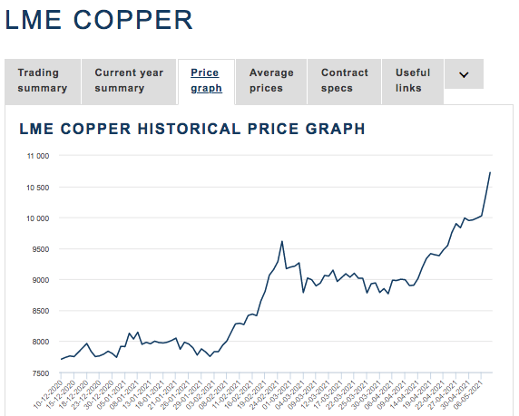

# Trading Strategies with Derivatives

It is possible to describe a trading strategy as an extensive plan for all your trading activities. It is a framework the trader creates to guide himself in all trading scenarios. Investopedia defines a trading strategy as:  

> _"A method of buying and selling in markets based on predefined rules used to make trading decisions."_  ****

A trading plan goal is to mitigate financial risk you are exposed to, thus reducing the volatility of your portfolio. Traders may find it useful to adopt determined trading strategies if something unexpected happens in the market. These trading plans should define how you react to unexpected movements in the price of your portfolio’s underlying assets. In other words, having a trading strategy in place makes you prepared for the possible outcomes, thus preventing you from making impulsive decisions that could possibly lead to big financial losses \(Investopedia, 2019\).  Many types of trading strategies have been developed through the years. They are based largely on either technicals or fundamentals analysis. On one side, technical trading strategies rely on technical indicators to generate trading signals \(in fact, technical traders believe all information about a given security is contained in its price and that it moves in trends\). On the other side, fundamental trading strategies take fundamental factors into account \(e.g. Profitability\),  to generate a list of opportunities from which traders can start their strategy.  Hedging can be performed by using different derivative products. In regards to futures contracts, companies and traders can use these contracts to protect themselves against adverse price movements. They off-set their price risk, thereby securing themselves a pre-determined price for their product at a certain point in the future. There are various futures hedging strategies that can be used to absorb the negative short-term shocks of major events. Although futures hedging strategies can be customized to absorb these events, they can also be scaled to protect portfolios during longer-term declines as in the case of bear markets and recessions. 

> _"The main advantage for investors looking to participate in a futures contract is that it removes the uncertainty about the future price of a commodity, security, or a financial instrument. By locking in a price for which you are guaranteed to be able to buy or sell a particular asset, companies are able to eliminate the risk of any unexpected expenses or losses.”_

Position Tokens on Mettalex DEX allow traders to get linear exposure to the underlying asset price movements, with capped exposure thanks to the banded trading mechanism. These instruments are similar to futures contracts but with fixed margin requirements, no predetermined expiry date, and no obligation to buy/sell an asset at expiration. According to Invetopedia’s definition: 

> _“A futures contract is a standardized, legal agreement to buy or sell an asset at a predetermined price, and at a specified time in the future. At this specified date, the buyer must purchase the asset and the seller must sell the underlying asset at the agreed-upon price, regardless of the current market price at the expiration date of the contract. Futures contracts allow corporations \(especially corporations that are producers and/or consumers of commodities\) and investors to hedge against unfavorable price movements of the underlying assets.”_

## **Futures**

### **Hedging Risk Using Futures**

When a company invests in the futures market, it is locking in a more favorable price in advance of a transaction. For instance, let’s consider a steel rebar production company that plans to buy 100 tonne of steel scrap in six months in order to not slow down production and ensure that orders are fulfilled. Let’s also suppose the current market price for steel scrap to be $430,00 per tonne whereas the price of a six months futures contract to be equal to $420,00 per tonne. If the company believes to purchase steel scrap in the future, it may decide to take a long position in the futures contract.  In our example, by purchasing the futures contract, the steel production company can guarantee a price of $420,00 per tonne in a six months time. If after six months the price for steel scrap is $460,00 per tonne on the spot market, the hedging strategy put in place thanks to the long future contract will reduce the company's risk allowing it to close its position and buy 100 tonne of steel scrap for $420,00 per tonne at the contract's expiration date.

On the other hand, if a company plans to be selling a specific asset in the future, it may decide to take a short position in a futures contract with the expectation that the price of that specific asset will decline in value. Let’s again  consider the case in which the steel rebar production company needs to sell steel rebars in six months’ time. Let’s suppose the steel rebar market price to be $500,00 and the price of a six months futures contract to be equal to $480,00. The company decides to hedge against the volatility risk by shorting the contract. If after six months, the spot price for steel rebar goes down to $450,00 per tonne, in the case the company would have not hedged through a futures contract, it will experience financial damage as a result of a steep decline in the market price for steel rebar in the future. However, thanks to the short hedging strategy put in place, the company has guaranteed that it will receive $480,00 for every tonne of steel rebars that it sells.

### **Margin Requirements for Futures Trading**

Trading with futures can provide above-average profits but at the cost of taking above-average risk. Usually, there is no legal minimum on what balance you must maintain to day trade futures, although you must have enough in the account to cover all day trading margins and fluctuations which result from your positions. Futures are subject to variable margin requirements. A Margin Requirement is the percentage of marginable securities that an investor must pay for with own cash. Margins can be broken down into Initial Margin Requirements and Maintenance Margin Requirements. On top of these margins, we need to consider that futures markets typically use high leverage. Leverage means that the trader does not need to put up 100% of the contract's value amount when entering into a trade. Instead, the trader is required to deposit the initial initial margin amount, and a maintenance margin is the minimum equity an investor must hold in the margin account after the purchase has been made. ****Mettalex DEX trading system is based on a banded trading mechanism: each market on Mettalex has a band of reference \(Δ\) of prices which shows two values: a floor and a cap. The spot price trades inside this band and trades go on until the spot price hits one of either the cap or the floor.  The value of a Long and Short pair \(L/S pair\) of tokens is equal to the Δ, so the pair can be minted with an amount of collateral equal to Δ. The spot price data feed coming from the real-world moves within the band. As it trades away from the centre price \(i.e. the central value of the band\), it will be cheaper to buy tokens representing the trend opposite to the price movement. If the spot price breaches the band, the L/S pair will be settled automatically and all of the collateral will become claimable by the holders of the token that corresponds to the end of the band that was breached - long token holders for a cap breach and short token holders if the bottom is reached. The new spot price and the historical market volatility metrics will determine the new market band and thus the new Δ. Once a new market is launched new position tokens can be minted for trading to start again.   

Mettalex DEX allows users to open leveraged positions through position tokens. Leverage is dependent on the price movements and it is determined by the ratio between the spot price and the price of L tokens and S tokens as these will be only a fraction of the market spot price. This mechanism implies that as the spot price for a specific crypto or traditional commodity trades away from the centre of the band, it becomes cheaper to buy exposure for the position opposite the movement. In order to understand better how Mettalex DEX leverage works, let’s assume we want to purchase silver:

   **E.g.:** _At the time of writing, the price for this commodity on Mettalex DEX might range from $20,00 to $40,00 per ounce. This means a Δ of $20,00 centred around $30,00. The value of a long and short pair of tokens is equal to the Δ \($20,00\) with floor set at $20,00 and cap at $40,00. That is, depositing a collateral worth $20,00 will allow a L/S pair to be minted. Assuming a spot price of $30,00, when the tokens are minted, each token will have a value of $10,00 representing a leverage of $30,00/$10,00 = 3x. At this point, if the silver spot price increases to $35,00, the value of the long and short position token will vary, thus varying the leveraged exposure. In fact, the long position token value would be $15,00 and the short token value would be $5,00. These new prices imply the following leveraged exposures:_

* _Leverage of long position token: $35,00/$15,00 = 2,33x_
* _Leverage of short position token $35,00/$5,00 = 7x_

This scenario represents an incentive for market participants to provide liquidity for the short position and benefit from high gains if the spot price starts moving towards the bottom of the band. Let us now consider a copper producer. In order to hedge against any trend reversal in the copper price level, this company can either use the futures market or refer to the Mettalex DEX for decentralised hedging. A graph of the price of a copper futures, as reported by the LME, is shown below:

As we can see, the price for copper has risen up in the last 6 months reaching a price above $10.500,00 per tonne. Suppose the producer expects a drop in the price level due to a contraction in demand in the future because he believes that certain events will influence the price level and consumer preferences for this material. Let’s say he supposes the price to drop at $9.800,00 per tonne but on the market there is a future contract available at $10.533,50 per tonne with an expiry date in 3 months time. Futures exchanges set the initial margin requirements as well as the amount of maintenance margin required in order to operate and avoid the liquidation of your positions. If the initial margin requirement is set to be at 5% of the contract value, the user has to deposit an amount equal to: $10.533,50 \* 5% = $526,68.  This is equal to a 20x leverage exposure. ****In addition to this margin requirement, the user is asked to have a sufficient quantity of cash or collateral in their account. This is the maintenance margin requirement which is usually set around 25% of the securities owned. The maintenance margin helps ensure account holders maintain collateral in the account in the event the value of their securities fall. Without any hedging strategy put into place, the copper that the producer would mine, process and sell on the market would be subject to volatility risk. This means that the producer could possibly face the risk that the costs necessary to extract and process this material would not be fully covered by the sales revenues.  If the company decides to opt for the futures market, it can  buy a long future contract at the price of $10.533,50 per tonne of material it wishes to cover. If after 3 months the price falls to $9.500,00 and no hedging strategy has been put in place, each tonne of copper will be sold on the market at this price, whereas with a long future contract, these units would have been sold at $10.533,50 per tonne. As previously mentioned, futures are subject to margin call because investors need to always have sufficient balance in their account in order to avoid the liquidation of their positions. This means, copper futures require active maintenance of positions by the trader.

Futures contracts are more complex to use for hedging when compared to position tokens on the Mettalex DEX. Position tokens track the value of a reference asset and offer price exposure between the floor and cap values of a band of reference.

On Mettalex DEX, it is possible to open a Long or Short position without the need of minting a new pair of position tokens. The copper producer could buy a long position at the price of $3.359,42 or a short position at the price of $641,41. If we assume that the producer is willing to buy a CULONG position token on Mettalex DEX, he will have to pay the Long Price of $3.359,42, thus exposing to a potential loss of -$3.359,42 and a potential profit around +$570,00.  On the other hand, if the copper producer is willing to buy a CUSHORT position token on Mettalex DEX, he will have to pay the Short Price of $641,41, exposing himself to a potential loss equal to the  price paid for the token \(i.e. -$641,41\) and a potential profit of $3.359,42. As we can see, Mettalex’s cap and floor trading band gives confidence to traders since any potential losses will be limited to the initial acquisition cost of the tokens. Let’s now consider a change in the level of prices for copper. We are considering the same band of reference and same  Δ \(i.e. $4.000,00\). If the spot price reaches $9.500,00, we would notice that the price of long and short position tokens have changed accordingly to the spot price movements and variable weights applied to prices. The goal of these weights is to guarantee the price of long positions and price of short positions to be equal to Δ. Considering this price change, traders who want to purchase the CULONG position token on Mettalex DEX can do this by paying the long price, equal now to $2.500,00 hence exposing themselves to a potential profit of $1.500,00 and loss of -$2.500,00. Otherwise, it is possible to purchase the CUSHORT position token by paying the new short price of $1.500,00 and exposing to a potential loss equal to the price paid \(i.e. -$1.500,00\) and a potential profit of +$2.500,00. As we can see, the copper producer can hedge the risks considering the fact that position tokens max lost is equal to the price paid for them and considering the fact that trades take place inside a band of prices. If the copper producer believes the price of copper to drop consistently in the future due to major events, the max loss he could experience will be determined in the event of a band breach according to the type of positions owned. In this scenario, he can decide to purchase a position token on Mettalex DEX in order to hedge the risks of volatility. If the producer believes that the price will fall below the floor level \(let's say the price drops at $6.500,00\), then the producer may purchase a Short Position Token to protect himself against potential losses because if the spot hits the floor, the position will be settled and the short position holders will make a profit equal to the difference between the spot price and the floor price. As we can see, mettalex DEX allows users to protect themselves against price reversals in the underlying asset level through the characteristics of the position tokens and the price reference band, thus limiting losses.

On the other hand, if we consider that a future contract by LME on the same commodity is offered around $10.553,50, it is noticeable that the price difference between futures contracts and Mettalex position token is quite substantial. In fact, on Mettalex DEX it is possible to open positions with lower capital amounts, making commodity trading available for a wider variety of users. Furthermore, as position tokens are always fully collateralized, the need for margin calls and forced liquidations are totally offset.  A further differentiation between positions tokens and futures concerns the expiration date. On that date, if the producer had opted for a futures contract \(e.g. at 3 months\), once that period has elapsed, he will necessarily have to roll over the contract again if he wants to maintain the strategy. On Mettalex DEX, this operation is not necessary, as you do not need to roll your positions over time. This is due to the fact that position tokens are perpetual tokens, so holders do not need to roll over as token expiry reaches. As long as the real-world price of a commodity stays within the price band, positions on Mettalex remain open and there is no need to re-open them. This could take a longer or shorter time than 3 months. Price bands are determined based on historical volatility in mind, with the goal to keep markets open as long as possible. Another advantage of Mettalex position tokens is that they can be sold back to the market at any time against the Mettalex AMM which acts as counterparty in the exchange.

On top of trading operations, users can mint L/S position tokens on Mettalex DEX. A new pair can be minted by depositing as much collateral as the difference between the cap and floor values \(Δ\). In our example, the copper producer can access the Mettalex DEX, to mint a L/S position token pair by depositing a collateral equal to: $11.000,00 - $7.000,00 = $4.000,00. By doing this, the company mints a L/S pair of position tokens and the value of a long and short pair of tokens will be equal to the Δ \($4.000,00\) with cap set at $11.000,00 and floor at $7.000,00. At the time of writing, the copper spot price on Mettalex DEX is equal to $10.454,25 whereas the price of long and short position tokens representing copper on the Mettalex DEX are respectively $3.359,42 and $641,41. According to these prices, the long position leverage will be of $10.454,25 / $3359,42 = 3,11x and the short position leverage will be of $10.454,25 / $641,41 = 16,44x. At this point, the company can decide to trade these tokens on the open market depending on the strategy adopted.

### **Short Hedge Strategies**

A short hedge is used when you plan on selling your product at a future date and want to protect yourself against falling prices. For instance, a copper  producer will sell a copper futures contract and they will ship it at a future date. When the copper is shipped, the producer will offset this short hedge by buying back their futures contract. If there has been a drop in the spot market prices, it would mostly be offset by a gain in the futures transaction:

> _"Assume that the current spot price of soybeans is $10 per unit. After considering costs and expected profits, the farmer wants the minimum sale price to be $10.10 per unit, once his crop is ready. Assume also a futures contract on one unit of soybean with six months to expiry is available today for $10.10. The farmer can sell this futures contract to gain the required protection by locking in the sale price in the future. We have 3 possible scenarios:_
>
> * _The price of soybeans rises up to $13 in six months. The farmer will incur a loss of $2.90 \(i.e. sell price - buy price = $10.10 - $13.00\) on the futures contract. He will be able to sell his actual crop produce at the market rate of $13, which will lead to a net sale price of $13 - $2.90 = $10.10_
> * _If the price of soybeans remains at $10, the farmer will benefit from the futures contract \($10.10 - $10 = $0.10\). He will sell his soybeans at $10, leaving his net sale price at $10 + $0.10 = $10.10;_
> * _If the price declines to $7.50, the farmer will benefit from the futures contract \($10.10 - $7.50 = $2.60\). He will sell his crop produce at $7.50, making his net sale price $10.10 \($7.50 + $2.60\).”_

Short hedging through futures contracts, allows the producer to sell the quantity produced at available market rates, but eliminating possible fluctuations in prices.

### **Long Hedge Strategies**

A long hedge is used when you plan on buying a commodity such as steel scrap and want to protect against prices increasing. A Steel producer wanting to protect against raising scrap prices will buy Steel Scrap futures contracts in order to fix the price. When the producer books the order, they will offset their futures position by selling Steel Scrap futures. An increase in cash price would mostly be offset by a gain in the futures transaction. Let’s now consider the following example from Investopedia: 

> _"A soybean oil manufacturer who needs one unit of soybean in six months’ time. He is worried that soybean prices may increase in the near future. He can buy \(go long\) the same soybean futures contract to lock the buy price at his desired level of $10.10._
>
> * _If the price of soybean shoots up to say $13, the futures buyer will profit by $2.90 \(buy price = $13 - $10.10\) on the futures contract. He will buy the required soybean at the market price of $13, which will lead to a net buy price of -$13 + $2.90 = -$10.10 \(i.e. negative indicates net outflow for buying\);_
> * _If the price of soybean shoots up to say $13, the futures buyer will profit by $2.90 \(buy price = $13 - $10.10\) on the futures contract. He will buy the required soybean at the market price of $13, which will lead to a net buy price of -$13 + $2.90 = -$10.10 \(i.e. negative indicates net outflow for buying\);_
>
>   _If the price of soybeans remains at $10, the buyer will lose on the futures contract \($10 - $10.10 = -$0.10\). He will buy the required soybean at $10, taking his net buy price to -$10 - $0.10 = -$10.10;_
>
> * _If the price declines to $7.50, the buyer will lose on the futures contract \($7.50 - $10.10 = -$2.60\). He will buy required soybean at the market price of $7.50, taking his net buy price to -$7.50 - $2.60 = -$10.10.”_

As we can see, the soybean oil manufacturer is able to get his desired buy price, by using a futures contract. The actual crop produced is bought at available market rates and price fluctuations are mitigated by the futures contract.

### **Roll Yield Strategies**

An additional use of futures contracts can be found in rolling futures and futures strip strategies. According to Investopedia’s definition:

> _**"**Rolling futures contracts refers to extending the expiration or maturity of a position forward by closing the initial contract and opening a new longer-term contract for the same underlying asset at the then-current market price. A roll enables a trader to maintain the same risk position beyond the initial expiration of the contract, since futures contracts have finite expiration dates. It is usually carried out shortly before expiration of the initial contract and requires that the gain or loss on the original contract be settled.”_

Roll yield is the amount of return generated in the futures market after an investor rolls a short term contract into a longer term one and profits from the convergence of the futures price toward a higher spot price. Roll yield can assume positive or negative values depending on whether the future market is in contango or in backwardation. Positive roll yield occurs when a futures market is in backwardation, which occurs when the short term contracts trade at a premium to longer dated contracts. On the other hand, when the market is in contango, the longer term contracts are more expensive than short term contracts and roll yield will be negative. For instance, if a trader enters a long Brent Crude Oil future contract at $96 with a June expiry, he would close this trade before it expires and then enter into a new Brent Crude Oil contract at the current market rate and later expiry date. This way, rolling over allows users to avoid physical delivery and roll their positions prior to expiration of the future contract. Let’s now suppose the investor holds 100 Brent Crude Oil contracts and wants to buy 100 more on expiry at a later date in the future. If the contract's future price falls below the spot price, the investor will be rolling into the same contract but with a lower price of the underlying asset. Conversely, if the future’s price goes beyond its spot price, the investor will be paying more money for the Oil contract compared to the spot market. Thus, traders have to pay more money to maintain the same number of contracts. Regarding strip strategies using futures contracts, “_a futures strip is the buying or selling of futures contracts in sequential delivery months traded as a single transaction. This is most common in the energy futures market_”. An investor can choose to use a futures strip to lock in the price of a certain commodity for a year rather than rolling over their trade and repurchasing another futures contract every time a shorter-term futures contract expires. As previously said, rolling over can generate higher trading costs and even negative cash flows if the next futures contract is more expensive than the one that is expiring \(as it happens with contango phenomena\). Traders use futures strips to hedge and speculate on future price movements in oil, natural gas, or other commodity markets. In accordance with Investopedia, a futures strip is also called a calendar strip and can be:

* Long: if an investor is hedging against \(or speculating on\) rising prices in the underlying market;
* Short: if the investor is hedging against \(or speculating on\) falling prices in the underlying market.

### **Cross Hedging Strategies**

A cross-hedging \(or a cross hedge\) is a strategy that involves covering the financial risk arising from a market position by purchasing another financial instrument whose price is highly correlated so that the variations in the former are offset by those in the latter. Companies and speculative traders adopt cross hedging when they are unable to find contracts to hedge against potential variations in the price of a particular underlying asset. In these cases, the hedger needs to find a highly correlated asset for cross-hedging purposes. Positive correlation in prices of two assets means that if the price or value of one of the assets rises, the price of the other will also rise. It is noteworthy to say that cross hedging does not always guarantee a perfect hedge as assets could be not perfectly correlated. This implies that investors assume the risk that the assets’ prices can possibly move in opposite directions, thereby causing the position to become unhedged. An example of cross hedge strategy is the case of airlines aiming to cover their exposure to jet fuel prices. Since jet fuel futures contracts do not exist, their most relevant hedging option is to purchase crude oil \(e.g. Brent Crude Oil\) futures contracts. So, if airline companies expect the cost of jet fuel to rise in the future, they can purchase crude oil in the futures market. If the price of jet fuels rises in three months’ time, we expect an increase in the price of crude oil as well. This is due to positive correlation between these two commodity prices. These companies can purchase crude oil at today’s low price, and then get it after three months when the prices will be higher. They can sell that crude oil at that higher price in the future. This way, the risk of profits going down because of the increase in jet fuel price is kept under control. The profits they can make with crude oil trading will compensate for any losses with rising jet fuel prices. Another real use of a cross hedging strategy could be the following:

> ****_“Suppose you are the owner of a network of gold mines. Your company holds substantial amounts of gold in inventory, which you eventually sell to generate revenue. As such, your company’s profitability is directly tied to the price of gold. In accordance with your estimate your company can maintain profitability as long as the spot price of gold does not dip below $1.300,00 per ounce. The actual spot price is hovering around $1.500,00 but you have seen large swings in gold prices in the last periods and are eager to hedge the risk that prices decline in the future. To accomplish this, you set out to sell a series of gold futures contracts sufficient to cover your existing inventory of gold in addition to your next year’s production. However, you are unable to find the gold futures contracts you need and are therefore forced to initiate a cross hedge position by selling futures contracts in platinum, which is highly correlated with gold. To create the cross hedge position, you sell a quantity of platinum futures contracts sufficient to match the value of the gold you are trying to hedge against. As the seller of the platinum futures contracts, you are committing to deliver a specified amount of platinum at the date when the contract matures. In exchange, you will receive a specified amount of money on that same maturity date.  The amount of money you will receive from your platinum contracts is roughly equal to the current value of your gold holdings. Therefore, as long as gold prices continue to be strongly correlated with platinum, you are effectively locking in today's price of gold, protecting your margin. However, in adopting a cross hedge position, you are accepting the risk that gold and platinum prices might diverge before the maturity date of your contracts. If this happens, you will be forced to buy platinum at a higher price than you anticipated in order to fulfill your contracts."_

## **Options**

An option is a derivative contract that gives the buyer the right \(but not the obligation\) to buy or sell the underlying asset by a certain date \(i.e. expiration date\) and at a specified price \(i.e. strike price\). There are two types of options: calls and puts. Further differentiation can be made by distinguishing American-style options that can be exercised at any time prior to their expiration, and European-style options which can only be exercised on the expiration date. In order to enter into an option contract, the buyer must pay an option premium. The options’ intrinsic value is the value any given option would have if it were exercised today. Basically, the intrinsic value is the amount by which the strike price of an option is profitable or in-the-money \(ITM\) as compared to the stock's price in the market. If the strike price of the option is not profitable as compared to the price of the stock, the option is said to be out-of-the-money \(OTM\). If the strike price is equal to the stock's price in the market, the option is said to be at-the-money \(ATM\). By the way, the intrinsic value of an option does not consider how much or how little time is remaining until the option's expiration. The amount of time remaining on an option impacts the option premium and thus its value. You can buy a call in any of those three phases. However, you will pay a larger premium for an option that is in the money because it already has intrinsic value. The two most common types of options are calls and puts:

### **Call options**

Call options give the buyer the right, but not the obligation, to buy the underlying asset at the strike price specified in the option contract. Investors can buy calls when they believe the price of the underlying asset will increase and sell calls if they believe it will decrease. The buyer of a call option pays the option premium in full at the time of entering the contract. Afterward, the buyer faces a potential profit should the market move in his favor. Losses are limited at the purchase price, that is the premium. This is one of the most attractive features of buying options. For a limited investment, the buyer secures unlimited profit potential with a known and strictly limited potential loss. If the spot price of the underlying asset does not rise above the option strike price prior to the option’s expiration, then the investor loses the amount they paid for the option. However, if the price of the underlying asset does exceed the strike price, then the call buyer makes a profit. The amount of profit is the difference between the market price and the option’s strike price, multiplied by the incremental value of the underlying asset, minus the price paid for the option. The call option seller’s downside is potentially unlimited. As the spot price of the underlying asset exceeds the strike price, the writer of the option incurs a loss equal to the buyer‘s profit. However, if the market price of the underlying asset does not exceed the option strike price, then the option expires worthless. The option seller profits is the amount of the premium they received for the option. Let’s consider the following example from Investopedia: 

_**E.g.**: Suppose that Microsoft shares are trading at $108,00 per share. You own 100 shares of the stock and want to generate an income above and beyond the stock's dividend. You also believe that shares are unlikely to rise above $115,00 per share over the next month. You take a look at the call options for the following month and see that there is a $115,00 Call option trading at $0,37 per contract. So, you sell one call option and collect the $37,00 premium \($0,37 x 100 shares\), representing a roughly four percent annualized income._

_If the stock rises above $115,00, the option buyer will exercise the option and you will have to deliver the 100 shares of stock at $115,00 per share. You still generated a profit of $7.00 per share, but you will have missed out on any upside above $115,00. If the stock does not rise above $115,00, you keep the shares and the $37,00 in premium income._

### **Put options**

Put options give the buyer the right, but not the obligation, to sell the underlying asset at the strike price specified in the contract. The writer \(i.e. seller\) of the put option is obligated to buy the asset if the put buyer exercises their option. Investors buy puts when they believe the price of the underlying asset will decrease and sell puts if they believe it will increase. The value of a put option appreciates as the price of the underlying stock depreciates relative to the strike price. On the other hand, the value of a put option decreases as the value of the underlying stock increases. A put option's value also decreases as its expiration date approaches. Conversely, a put option loses its value as the underlying stock increases. Put options can be in, at, or out of the money, just like call options, and you can buy a put option in any of those three phases. Buyers will pay a larger premium when the option is in the money because it already has intrinsic value:

* In the money means the underlying asset price is below the put strike price;
* Out of the money means the underlying price is above the strike price;
* At the money means the underlying price and the strike price are the same.

In order to understand how put options work, let’s have a look at the following example:

_**E.g.**: Assume an investor owns one put option on the SPDR S&P 500 ETF \(SPY\) and assume it is currently trading at $277,00 with a strike price of $260,00 expiring in one month. For this option, the premium paid is $0,72 per share. If the trader wants to trade options for 100 shares, he will have to pay $72,00 \($0,72 x 100 shares\). The investor has the right to sell 100 shares at a price of $260,00 until the expiration date in one month. If the shares of SPY fall to $250,00 and the investor exercises the option, the investor could establish a short sell position in SPY, as if it were initiated from a price of $260,00 per share. Alternatively, the investor could purchase 100 shares of SPY for $250,00 in the market and sell the shares to the option's writer for $260,00 each. This way, the investor would make $1,000,00 \(100 x \($260,00 - $250,00\)\) on the put option, less the $72,00 cost they paid for the option. Net profit would be equal to $1,000,00 - $72,00 = $928,00 less any commission costs. The maximum loss on the trade is limited to the premium paid, or $72,00. The maximum profit is attained if SPY falls to $0._**.**

### **Put vs Call options**

While a put option is a contract that gives investors the right to sell at a later time at a specified price, a call option is a contract that gives the investor the right to buy later on. Unlike put options, call options are generally a bullish bet on a particular underlying asset, and tend to make a profit when the underlying security of the option goes up in price.  Put or call options are often traded when the investor expects the  security to move in some way in a set period of time, often before or after an earnings report, acquisition, merger or other business events. When purchasing a call option, the investor believes the price of the underlying security will go up before the expiration date, and can generate profits by buying the stock at a lower price than its market value. 

The biggest risk of a call option is that the stock price may only increase a little bit. This would mean you could lose money on your investment. This is because you must pay a premium per share. If the stock doesn’t make up the cost of the premium amount, you may receive minimal returns on this investment. 

   _**E.g.**: If a stock of XYZ is trading at $60,00 per share and you predict it will rise, you may decide to purchase a call option at $63,00 a share for 100 shares, with a premium of $1,75 per share. If the stock price only goes up to $65,00 a share and you executed your option, it would be worth $6,500. This would only result in a $25 gain because you must subtract the premium amount from your total gain \($6,500-$6,300-$175=$25\). But if you purchased the shares outright you would have gained $500. With a put option, you are managing the risk in your portfolio. So, let’s suppose you have 100 shares of Stock XYZ currently worth $100,00 and you think the price will fall. You may purchase a put option with the right to sell at $100,00 a share. If the price drops to $90 per share you can exercise this option. This means instead of losing $1.000,00 in the market you may only lose your premium amount._

As it is possible to see, option contracts are somehow comparable to Long/Short Position Tokens available on Mettalex DEX. Options allow traders to set a cap or a floor to their position thus helping them into setting up hedging strategies whose purpose is to protect them against adverse price movements in the level of the underlying asset of reference. If for options the maximum loss traders can experience is equal to the premium paid to purchase it, on Mettalex DEX traders are confident that within the banded mechanism system, the maximum loss they can experience is equal to the cost they pay to buy the position token representing the trend they considered in their strategies. Options cap and floor can be modified thanks to different strategies that traders can put into place in order to reduce their risks and thus guaranteeing the perfect coverage of each position they have in their portfolio.   
**Strategies using options**

#### **Covered Call**

This is a very popular strategy. A covered call strategy involves holding a long position in the underlying asset \(e.g. stock\) and selling \(writing\) a call option on the underlying asset. The strategy is usually employed by investors who believe that the underlying asset will experience only minor price fluctuations.  The buyer pays the seller of the call option a premium to obtain the right to buy shares or contracts at a predetermined future price. The premium is paid on the day the option is sold and it is the seller’s money to keep, regardless of whether the option is exercised or not. A covered call is therefore most profitable if the underlying asset price moves up to the strike price, generating profit from the long position, while the call that was sold expires worthless, allowing the call writer to collect the entire premium from its sale. An investor might choose to use this strategy if they purchased a short term position or have a neutral opinion on the direction the underlying asset price will undertake in time. The investor might be looking to generate income through the sale of the premium or might want to protect against a potential decline in the underlying asset’s value. The main advantage of the covered call strategy is that an investor receives a guaranteed income as a premium from the sale of a call option. If the price of the underlying asset slightly increases, the premium will raise the total return on the investment. In addition, if the price of the underlying asset slightly declines, the premium will offset the loss portion. However, it is not recommended to use a covered call strategy if you expect a substantial appreciation of the underlying asset because your profits are locked to the strike price of the call option. At the same time, if the price of the underlying asset significantly declines, the premium from the sale of the call will now cover only a small portion of the losses.

#### **Married Put**

In order to create this strategy, the investor is required to purchase an asset and purchase an equivalent number of put options. A married put is a strategy where a long investor purchases a put option which will have a strike price lower than the current stock price. By owning the put as well as the underlying asset, the investor is protected from any downside below the strike price since the investor can exercise the put and sell the underlying. This strategy works like an insurance policy: in fact, it establishes a price floor in the event the asset’s price falls sharply. At the same time, the investor would be able to participate in every upside opportunity if the asset gains in value. The only disadvantage of this strategy is that if the asset does not fall in value, the investor loses the amount of the premium paid for the put option. With the long put and long positions combined the losses are limited.

#### **Vertical Spreads**

A vertical spread is an options strategy constructed by simultaneously buying an option and selling an option of the same type and expiration date, but different strike prices. A call vertical spread consists of buying and selling call options at different strike prices at the same expiration, while a put vertical spread consists of buying and selling put options at different strike prices at the same expiration. According to Investopedia, there are several varieties of vertical spreads: 

* **Bulls**: bullish traders will use bull call spreads or bull put spreads. For both strategies, the trader buys the option with the lower strike price and sells the options with the higher strike price. Aside from the difference in the option types, the main variation is in the timing of the cash flows. The bull call spread results in a net debit, while the bull put spread results in a net credit at the outset.
* **Bull Call Spread**: the trader needs to buy a call option and simultaneously sell another call option at a higher strike price and both need to be on the same underlying asset. Both options need to be in the same expiration cycle. This strategy generates a profit when the share price increases, as the call spread's value rises with the underlying price. Ideally, the asset price should rise to the short call's strike price by expiration. Traders can buy call spreads when they believe an asset’s price will increase, but not necessarily to a price higher than the strike price of the call which is sold.
* **Bull Put Spread**: the bullish vertical spread is built with put options: one short put and one long put at a lower strike price in the same expiration. The maximum profit potential occurs when the stock price is above the short put's strike price at expiration, while the maximum loss potential occurs when the share price is below the long put's strike price at expiration. In conclusion, traders who sell put spreads want the underlying asset price to rise or trade sideways as time passes, as both will result in the spread losing value over time \(generating profits for the put spread seller\). 
* **Bears**: ****bearish traders utilize bear call spreads or bear put spreads. For these strategies, the trader sells the option with the lower strike price and buys the option with the higher strike price. Here, the bear put spread results in a net debit, while the bear call spread results in a net credit to the trader's account.
* **Bear Call Spread**: ****a bearish call spread is realized by selling a call option while simultaneously buying another call option at a higher strike price \(same expiration cycle\). The maximum profit potential is realized when the underlying price is below the short call's strike price at expiration, while the maximum loss potential is realized when the price is above the long call's strike price at expiration. So, sellers of call spreads want the underlying asset price to fall or trade sideways as time passes, as both of these events will lead to a decrease in the price of the spread, and therefore profits for the call spread seller.
* **Bear Put Spread**: ****a bearish put spread is built by buying a put option while simultaneously selling another put option at a lower strike price with the same expiry date. The maximum profit potential is realized when the underlying asset price is below the short put's strike price at expiration, while the maximum loss potential is realized when the price is above the long put's strike price at expiration. Hence, buyers of put spreads want the underlying asset price to fall to a price equal to or greater than the short put's strike price, as the put spread's price will approach its maximum potential value.

#### **Protective Put**

Protective puts are commonly used when an investor is long or purchases assets they want to include in their portfolio. An investor who owns an asset faces the risk of taking a loss on the investment if the asset’s price declines below the purchase price. By purchasing a put option, any losses on the asset are limited. This strategy sets a determined floor price below which the investor will not continue to lose any added money even as the underlying asset's price continues to fall. Protective puts may be placed on stocks, currencies, commodities, and indexes to some protection to any downside. A protective put acts as an insurance policy by providing downside protection in the event the price of the asset declines. A protective put keeps downside losses limited while preserving unlimited potential gains to the upside. However, the strategy involves being long the underlying asset. If the asset keeps rising, the long position benefits and the purchased put option will end up worthlessly. The amount lost is equal to the premium paid to buy the put option. In this scenario where the original put expired, the investor will buy another protective put, again protecting his holdings. Protective puts can cover a portion of an investor's long position or their entire holdings. When the ratio of protective put coverage is equal to the amount of long positions, the strategy is known as a married put.

#### **Hedge Wrapper - Protective Collar**

A collar option strategy \(or hedge wrapper\) is an option strategy employed to reduce both positive and negative returns of an underlying asset. It limits the return of the portfolio to a specified range and can hedge a position against potential volatility of the underlying asset. A collar position is created through the usage of a protective put and covered call option. More specifically, it is created by holding an underlying stock, buying an out of the money put option, and selling an out of the money call option. The collar position involves purchasing a long position on an underlying asset, a long position on the out-of-the-money put option, and a short position on the out-of-the-money call option. By taking a long position in the underlying asset, when the price increases, the investor will profit. As the price decreases, the investor will experience a loss. Holding a long position on an OTM put option means that when the price of the underlying stock decreases, the put option value increases. The investor will also take a short position on an OTM call option. If the price of the underlying asset increases, the call option will be exercised by the buyer. Therefore, as the seller, you will experience a loss as the underlying asset increases in price. The value of the underlying asset between the strike price of the put option and call option is the value of the portfolio that moves. The loss experienced by the call option above the call strike price will cancel with gains from the stock appreciating, therefore the payoff will be flat here. The gains experienced by the put option below the strike price will cancel with the loss from the depreciating stock price. 

This is a very popular flexible hedging strategy. In fact, if an investor holds a long position on an asset, they can put on a collar position to protect against large losses coming from a depreciation in its value. It is through the usage of the protective put option that the trader will gain when the underlying asset falls in price. The covered call option is sold which can be used to pay for the put option and it will still allow potential upside from an appreciation in the underlying asset, up to the call’s strike price. If an asset has a  strong long term potential, but in the short term it is exposed to a high down-side risk then a collar might be considered. Investors will also consider a collar strategy if they opened a long position on an asset and this one has recently appreciated significantly. To protect these unrealized gains a collar may be used.

#### **Straddle**

A straddle strategy involves the buying or selling of call/put options which have the same underlying asset, strike price, and same expiry date. The investor often uses this strategy when they believe the price of the underlying asset will move out of a specific range. This strategy allows the investor to have the opportunity for unlimited gains. At the same time, the maximum loss this investor can experience is limited to the cost of both options contracts combined, so both the premium for the call and put options.. There are two break even points in this strategy. In fact, this strategy becomes profitable when the asset makes a large move in one direction or the other. The idea is to benefit when there are high/low price variations so that the new values of Call/Put options are far greater/lesser than the values when the strategy was started. This can offset the cost of the trade and the remainder can be profit. Cost for any straddle The investor does not need to care in which direction the asset moves, only that it is a greater move than the total premium the investor paid for the structure. A straddle is not a risk-free proposition and can fail in a dull market. We need to distinguish between:

* **Long straddle**: this strategy involves buying both call and put options with the same expiry date, strike price and underlying asset \(index, commodity, currency, interest rates\). The best time to buy the call/put options is when they are undervalued or discounted independently of the security’s spot price trend. The strategy involves limited risk, as the cost of both the options is the maximum value that the trader can lose in this trade. With this strategy, the trader can suffer maximum loss when both options expire at-the-money, thus turning them worthless. In such a case, the trader has to pay the difference between the value of premiums plus commissions on both option trades. 
* **Short straddle**: this strategy involves the selling  of both call and put options with the same expiry date, strike price and underlying asset. The best time to sell call/put options is when they are overvalued irrespective of where the spot price of security moves and its magnitude. This strategy involves unlimited risk, as one may lose up to the entire value of the security if the trader sells both options, but profit will be limited to the premiums received on both options. However, the losses can actually be manifold.

A straddle should be constructed at a time when it is not close to the expiry date. Moreover, the trader opening this strategy should not keep it open till the expiry date, as chances of a failure are often quite high nearer to expiry.

#### **Strangle**

With this strategy, the investor purchases an out-of-the-money call option and an out-of-the-money put option simultaneously on the same underlying asset with the same expiration date. Losses are limited to the costs for both options, that is the premiums paid to purchase them. Strangles are often less expensive than straddles because the options purchased are out-of-the-money options. This strategy shows two breakeven points: in fact, this strategy becomes profitable when the asset price makes a large move in one direction or the other. The only thing the investor knows is that the movement in price he expects is a greater move than the total premium the investor paid for the structure.

#### **Butterfly Spread**

Butterfly Spread Option is a neutral option strategy that involves a lesser grade of risk for the trader. The option strategy involves a combination of various bull spreads and bear spreads strategies. The holder combines four option contracts having the same expiry date at three strike price points, which can create a perfect range of prices and make some profit for the holder. A trader buys two option contracts: one at a higher strike price and one at a lower strike price and sells two option contracts at a strike price in between. The difference between the high and low strike prices is equal to the middle strike price. Both calls and puts can be used for a butterfly spread. Any butterfly option strategy involves the following requirements:

* Buying or selling of call/put options;
* Same underlying asset;
* Combining four option contracts;
* Different strike prices \(with two contracts at same strike price\);
* Same expiry date.

This strategy should be considered when the trader does not expect the security prices to be very volatile in future. That allows the trader to earn a certain amount of profit with limited exposure to risks. The best result of the strategy is obtained when near to expiry and at the money \( i.e. the price of the underlying is equal to the middle strike price\). In this strategy, you can go either purchase calls or puts or a combination of both. In the same way, you either go long or short on options or a combination of longs and shorts depending on what you are feeling and thinking about the future. When the cash price is equal to the middle strike price, the trader will earn the maximum profit, but if the cash price is between the high and low strike prices, the variability of earning profit remains due to trading costs and taxes and there can be a chance that the trader will incur loss because of high trading cost. We distinguish between:

* **Long Call/Put Butterfly**: the trader buys a call/put option at higher strike price and one at lower strike price, and simultaneously sells two calls/puts at a strike price near to the cash price of the same expiry and underlying asset. This strategy involves limited risk, as the maximum amount the trader can lose is the cost of call/put options and it will occur when the cash price trades beyond the range of high and low strike prices at expiry. The maximum profitability will be when the cash price is equal to the middle strike price on the expiry day.
* **Short Call/Put Butterfly**: the trader sells a call/put option at higher strike price and one at lower strike price, and simultaneously buys two calls/puts at a strike price near to cash price of the same underlying asset and of same expiry. The maximum a trader may lose is the strike price of long call/put options and that will occur when the cash price is at the same level. The maximum profit will be when the cash price is beyond the range of lower and higher strike prices on the expiry day.

#### **Iron Condor**

This is a non-directional option strategy, in which an option trader combines bull put spread and bear call spread to generate profit. In an Iron Condor option strategy, an option trader sells a call option while at the same time buys another call with a higher strike price. Simultaneously, he buys a put option and at the same time buys another put option at a lower strike price, but both expiring at the same time. Thus it is a combination of both Bull Put spread and Bear Call spread. In this strategy, there is a high probability of limited gain. An option trader opts for this strategy if he believes that the market is going to be range bound. The maximum profit in an Iron Condor strategy is equal to the net premium received adjusted for commissions. The maximum loss occurs when the price of the underlying security is higher than the strike price of the long call or when the price of the underlying security is less than the strike price of the long put. This strategy implies both risks and rewards to be limited.

#### **Iron Butterfly**

The user of the strategy combines four option contracts with three different strike prices of the same expiry date: he buys/sells higher strike price put/call options along with lower strike price call/put options, both of which are OTM, and also buys/sells another set of ATM call/put options at the middle strike price. According to the Economic Times, “_in Iron Butterfly, there is a higher probability of earning profit because the way it is constructed by combining Calls and Puts or bear put and bull call spread, it becomes different from a classic Butterfly option strategy, where the strategy involves a combination of either bull spreads or bear spreads. The strategy gives best result and maximum profit when it is near to expiry and ATM, which means the underlying price is equal to the mid-strike price out of all strike prices. In this strategy, a butterfly-like image is formed where the Call and Put options of the mid-strike price form the ‘body’ and Call and Put options at higher and lower strike prices form the wings._” 

Thus, an iron butterfly option strategy involves the following requirements to be respected:

* Buying and selling of call/put options \(Bull Call spread & Bear Put spread combination\);
* All options have to have the same underlying asset with same expiry date/expiration;
* Four option contracts need to be involved in the construction of this option strategy;
* The strategy needs to consider three different strike prices; higher, middle and lower. On top of this, the difference between the middle strike price and the lower strike price or the upper strike price is the same. Thus, two contracts among the necessary four, need to have the same strike price.

We can distinguish between:

* **Long Iron Butterfly**: This means buying one Call option at a higher strike price and Put option at a lower strike price, and simultaneously selling call and put options at a strike price near to cash price or the middle strike price of the same expiry and underlying asset. The maximum amount a trader may lose is equal to: Long Call option strike price – Short put option strike price – net premium received + taxes paid, when the cash price is beyond the range of high and low strike prices on expiry. It will generate the maximum profit when the cash price is equal to middle strike price on the expiry day.
* **Short Iron Butterfly**: this strategy implies selling one call option at a higher strike price and one put option at a lower strike price and, simultaneously, buying call and put options at a strike price near the cash price of the same expiry and underlying asset. A trader may lose the maximum of premium paid plus taxes, which will occur when the cash price trades at the same level. It will earn maximum profit when the cash price is beyond the range of lower and higher strike prices on the expiry day:

Profit = \(Short Call or Long Put\) Strike Price – \(Short Put or Long Call\) Strike Price - Premium Paid – Taxes\).

### **Hedging on Mettalex**

Futures and options are similar in many ways, but often tend to be used for different purposes. A futures contract is the preferred choice for many active traders who want to profit from the up or down moves in the commodities market. Their standardized features and very high levels of leverage make them particularly useful for investors who want to take part in the commodities market. The high leverage allows those investors to participate in markets to which they might not have had access otherwise. This results in a better liquidity when compared to the options market, and hence the bid-ask spreads are usually closer with futures than with options. It is a very important consideration when margins are tight and the trader works with a limited amount of cash. Futures, as well as options are a great way to insure an investment, protecting it from a decrease in value, or simply for speculation, thus betting on the rise or fall in the underlying asset price. 

On the Mettalex DEX, position tokens allow linear exposure to the underlying asset price movements with banded exposure and can serve the same purposes. They are similar to futures contracts but with fixed margin requirements, so users do not need to perform an active maintenance in order to avoid margin calls, and eventually the liquidation of their positions. On the other hand, options and position tokens are very similar in the sense that both place a floor and a cap value to the spot price movement: traders holding position tokens have the guarantee that the maximum loss they can experience is equal to the price paid for each token and no further. This is like a put option, which sets a floor value under which the spot price can not decrease. Hence, the maximum loss experienced by the option holder will be equal to the premium paid to purchase the put option \(it is very similar to what position tokens offer to traders on Mettalex DEX\).

Options offer advanced traders the possibility to combine put and call options or even create a synthetic position that behaves like a real holding of the underlying asset. The pricing mechanism, however, is way more complex than the mechanism behind futures contracts, thus these instruments should be used by those who know what they are investing their money in. When talking about futures, it is noteworthy to say that the futures price should be the same as the current spot price plus the cost of carrying \(i.e. storing\) the underlying asset until the maturity of the futures contract. The pricing mechanism behind Mettalex position tokens is based on a series of different constraints whose purpose is to change the weights applied to the price of Long and Short position tokens in respect to variation of the quantities of tokens in the pool of reference representing the asset chosen by the trader. 

An additional difference between futures and options is given by the fact that options are subject to time decay, so their value declines over time. This is determined by different factors, such as the time to expiry \(in fact we distinguish among ITM, ATM, OTM options according to their intrinsic values\). This means that the option holder has to pay attention to time decay because it can severely erode the profitability of an option position or turn a winning position into a losing one very quickly. Futures, as well as position tokens, do not have to face risks connected with time decay losses.    
****

